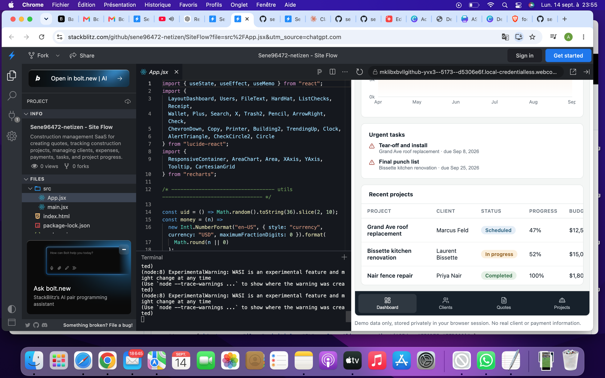

# SiteFlow

Construction management SaaS designed to help construction companies manage their projects from quotes to completion.

## 🚧 Project Overview

SiteFlow is a web application focused on simplifying construction project management.

It brings together clients, quotes, construction sites, tasks, expenses, payments, and project progress in one centralized platform.

## 📸 Application Preview

## ✨ Main Features

- 📊 Dashboard with project and financial overview
- 👥 Client management
- 📝 Quote creation and management
- 🏗️ Construction project tracking
- ✅ Task management
- 💰 Expense and payment tracking
- 📄 Document management
- 👷 Team management
- 📈 Project progress monitoring
- 🔔 Notifications
- 🔎 Global search

## 🛠️ Technologies

- React
- JavaScript / JSX
- Vite
- Lucide React
- Recharts

## 🎯 Project Goal

The goal of SiteFlow is to create a practical digital workspace for construction professionals, combining project management and financial tracking in a single application.

## 🚀 Live Demo

[▶️ Open SiteFlow Live Demo](https://stackblitz.com/github/sene96472-netizen/SiteFlow?file=src%2FApp.jsx)

## 👨‍💻 Developer

**Assane Sene**

Computer Science & AI student interested in software development, artificial intelligence, data science, and robotics.
